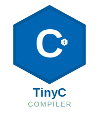

# TinyC Compiler



**A complete, educational C-like compiler built from scratch**

[](https://github.com/ryan-tobin/tiny-c-compiler/actions)
[](https://opensource.org/licenses/MIT)
[](https://en.wikipedia.org/wiki/C99)

## Overview

TinyC is a complete compiler implementation that demonstrates all phases of compilation from source code to executable programs. Built entirely from scratch in C99, it showcases fundamental compiler construction techniques including lexical analysis, parsing, semantic analysis, and x86-64 code generation.

## Features

### **Complete Compilation Pipeline**
- **Lexical Analysis**: Token recognition with error reporting
- **Syntax Analysis**: Recursive descent parser with AST generation
- **Semantic Analysis**: Type checking, scope resolution, symbol tables
- **Code Generation**: Direct x86-64 assembly output
- **Integration**: GCC linking for executable creation

### **Language Support**
- Variables and assignments
- Arithmetic expressions with proper precedence
- Control flow: `if/else`, `while`, `for` loops
- Functions with parameters and return values
- String and numeric literals
- Block scoping and local variables
- Type system with basic types (`int`, `char`, `void`, `char*`)

### **Developer Experience**
- Comprehensive error messages with line/column information
- Debug modes for tokens, AST, and symbols
- Extensive test suite with unit and integration tests
- Memory-safe implementation with proper cleanup
- Modular architecture for easy extension

## Installation

### Prerequisites
- GCC or compatible C compiler
- GNU Make
- Linux/Unix environment (tested on Ubuntu/Debian)

### Build from Source
```bash
git clone https://github.com/ryan-tobin/tiny-c-compiler.git
cd tiny-c-compiler
make
```

### Run Tests
```bash
make test           # Run all tests
make examples       # Test with example programs
```

## Quick Start

### Hello World Example
Create a file `hello.tc`:
```c
int main() {
    return 42;
}
```

Compile and run:
```bash
./build/tcc hello.tc
./hello
echo $?  # Prints: 42
```

### More Complex Example
```c
int factorial(int n) {
    if (n <= 1) {
        return 1;
    }
    return n * factorial(n - 1);
}

int main() {
    int result = factorial(5);
    return result;  // Returns 120
}
```

## Usage

### Basic Compilation
```bash
# Compile to executable
./build/tcc program.tc

# Specify output name  
./build/tcc -o my_program program.tc

# Generate assembly only
./build/tcc --compile-only -o program.s program.tc
```

### Debug Options
```bash
# Show token stream
./build/tcc --debug-tokens program.tc

# Show Abstract Syntax Tree
./build/tcc --debug-ast program.tc

# Show all debug information
./build/tcc --debug-tokens --debug-ast program.tc
```

## Architecture

### Compilation Phases

```
┌─────────────┐    ┌─────────────┐    ┌─────────────┐
│   Source    │───▶│    Lexer    │───▶│   Parser    │
│    Code     │    │ (Tokenizer) │    │   (AST)     │
└─────────────┘    └─────────────┘    └─────────────┘
                                              │
                                              ▼
┌─────────────┐    ┌─────────────┐    ┌─────────────┐
│  Assembly   │◄───│  Code Gen   │◄───│  Semantic   │
│   Output    │    │ (x86-64)    │    │  Analysis   │
└─────────────┘    └─────────────┘    └─────────────┘
```

### Module Structure
```
src/
├── lexer.{c,h}      # Tokenization and lexical analysis
├── parser.{c,h}     # Recursive descent parser
├── ast.{c,h}        # Abstract Syntax Tree definitions
├── semantic.{c,h}   # Type checking and symbol resolution
├── codegen.{c,h}    # x86-64 assembly generation
├── ir.{c,h}         # Intermediate representation (planned)
├── optimizer.{c,h}  # Optimization passes (planned)
├── utils.{c,h}      # Utility functions
└── main.c           # Compiler driver
```

## Testing

### Test Categories

| Test Type | Command | Description |
|-----------|---------|-------------|
| Unit Tests | `make test-lexer` | Lexer tokenization tests |
| | `make test-parser` | Parser AST generation tests |
| | `make test-semantic` | Semantic analysis tests |
| | `make test-codegen` | Code generation tests |
| Integration | `make examples` | End-to-end compilation tests |
| All Tests | `make test` | Complete test suite |

### Example Programs
The `examples/` directory contains sample TinyC programs:
- `hello_world.tc` - Basic program structure
- `fibonacci.tc` - Recursive function example
- `factorial.tc` - Mathematical computation
- `variables.tc` - Variable usage and scoping

## Language Reference

### Supported Grammar
```ebnf
program        ::= declaration*
declaration    ::= function_decl | var_decl
function_decl  ::= type IDENTIFIER '(' parameter_list? ')' compound_stmt
var_decl       ::= type IDENTIFIER ('=' expression)? ';'

statement      ::= compound_stmt | if_stmt | while_stmt | for_stmt 
                | return_stmt | expression_stmt | var_decl
                
expression     ::= assignment
assignment     ::= logical_or ('=' assignment)?
logical_or     ::= logical_and ('||' logical_and)*
logical_and    ::= equality ('&&' equality)*
equality       ::= relational (('==' | '!=') relational)*
relational     ::= additive (('<' | '>' | '<=' | '>=') additive)*
additive       ::= multiplicative (('+' | '-') multiplicative)*
multiplicative ::= unary (('*' | '/' | '%') unary)*
unary          ::= ('!' | '-' | '+')? postfix
postfix        ::= primary ('(' argument_list? ')')*
primary        ::= IDENTIFIER | NUMBER | STRING | '(' expression ')'
```

### Data Types
- `int` - 32-bit signed integer
- `char` - 8-bit character
- `void` - No value (functions only)
- `char*` - String literals

### Operators (by precedence)
1. `()` - Function calls, grouping
2. `!`, `-`, `+` - Unary operators
3. `*`, `/`, `%` - Multiplicative
4. `+`, `-` - Additive
5. `<`, `>`, `<=`, `>=` - Relational
6. `==`, `!=` - Equality
7. `&&` - Logical AND
8. `||` - Logical OR
9. `=` - Assignment

## Development

### Building Debug Version
```bash
make debug          # Build with debug symbols and sanitizers
make clean debug    # Clean build with debugging
```

### Adding New Features
1. **Lexer**: Add new tokens in `lexer.h` and recognition in `lexer.c`
2. **Parser**: Extend grammar rules in `parser.c`
3. **AST**: Add new node types in `ast.h`
4. **Semantic**: Add validation in `semantic.c`
5. **Codegen**: Add assembly generation in `codegen.c`

### Code Style
- C99 standard compliance
- 4-space indentation
- Descriptive function and variable names
- Comprehensive error handling
- Memory safety (no leaks)

## Extending the Compiler

### Planned Features
- [ ] Intermediate Representation (IR) layer
- [ ] Optimization passes (constant folding, dead code elimination)
- [ ] Additional data types (float, arrays, structs)
- [ ] More control flow (switch/case, break/continue)
- [ ] Enhanced standard library
- [ ] LLVM IR backend option

### Contributing
1. Fork the repository
2. Create a feature branch
3. Add tests for new functionality
4. Ensure all tests pass
5. Submit a pull request

## Educational Resources

This compiler serves as an excellent educational resource for:
- **Computer Science Students**: Understanding compilation phases
- **Language Designers**: Practical parser and semantic analysis
- **Systems Programmers**: Assembly generation and linking
- **Compiler Engineers**: Real-world compiler techniques

### Learning Path
1. Start with the lexer to understand tokenization
2. Study the parser for AST construction techniques
3. Examine semantic analysis for type systems
4. Explore code generation for assembly output
5. Run tests to see the complete pipeline in action

## Benchmarks

| Program | Lines | Compile Time | Generated Assembly |
|---------|-------|--------------|-------------------|
| Hello World | 3 | <1ms | 15 lines |
| Fibonacci | 8 | <5ms | 45 lines |
| Factorial | 12 | <10ms | 60 lines |

## Troubleshooting

### Common Issues

**Compilation Errors:**
```bash
# Missing GCC
sudo apt-get install gcc

# Missing Make
sudo apt-get install make
```

**Assembly Errors:**
- Ensure GNU assembler compatibility
- Check x86-64 target architecture

**Runtime Errors:**
- Verify executable permissions
- Check return codes for debugging

## License

This project is licensed under the MIT License - see the [LICENSE](LICENSE) file for details.

## Acknowledgments

- Inspired by classic compiler textbooks and courses
- Built using traditional compiler construction techniques
- Thanks to the open-source community for tools and inspiration

## Support

- **Issues**: [GitHub Issues](https://github.com/ryan-tobin/tiny-c-compiler/issues)
- **Discussions**: [GitHub Discussions](https://github.com/ryan-tobin/tiny-c-compiler/discussions)
- **Wiki**: [Project Wiki](https://github.com/ryan-tobin/tiny-c-compiler/wiki)

---

**Made with ❤️ for computer science education and compiler enthusiasts**

*TinyC Compiler - From tokens to executables, one phase at a time*